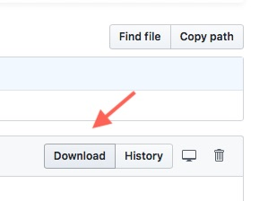

# Doximizer
[English version of this document](#README.md)

## Hintergrund
Die Doxie Software ist für alle Scannermodelle identisch, die einzelnen Module (OCR, Stitching) werden jeweils dann freigeschlatet, wenn das erste Mal ein Scan des jeweiligen Scanners importiert wird. Zusätzlich prüft die Software bei jedem Import, ob die Grafikdatei von einem Doxie erstellt wurde und von welchem.

Details siehe unten [Informationen zu den Exif-Daten](#informationen-zu-den-exif-daten)

### Installation
#### Doxie Software beim Hersteller laden
Die Doxie Software (~100 MB) macht sich nicht auf dem Rechner breit und hängt sich in keine Systemroutinen.
<https://www.getdoxie.com/resources/files/download_current_mac.php>

Bevor die Doxiemizer Skripte installiert werden, einmal die Doxie Software starten, damit die notwendigen Preference Dateien angelegt werden.

Man braucht keine Seriennummer zur Installation und Nutzung der Doxiesoftware, die Berechtigung wird über die Exit-Daten in den gescannten Bildern gesteuert.

#### Doxiemizer Installer laden

[Doxiemizer Installer (2.3 MB)](Doxiemizer%20Installer.zip)

(wenn der Download nicht startet, den Download button anklicken)

Das ZIP entpacken und den Installer doppelklicken, Bitte beachten: die Doxie Software sollte vorher einmal gestartet worden sein.

### Der Installer installiert:

* zwei Dienste für das Finder Kontextmenü (s.u.)
* ein Folder Action Script, das automatisch beim Mounten eines Volumes erkennt sobald etwas zum Import ansteht und dann die "Scanner"software startet
* zusätzlich wird auch automatisch der baugleiche IRIScann Anywhere erkannt und das Format angepaßt
* ein Script für die Texterkennung in gestitchten Dokumenten
* ein kleines Binary ´pdf2jpeg´ für die Konvertierung von PDFs in einzelne JPG Seiten für nachträgliches OCR
* die Benutzerdokumentation
* einen Unistaller, der liegt nach der Installation auf dem Desktop und entfernt alles, was der Installer installiert hat, bei Bedarf wieder.

## Anwendung:
Dateien (irgendwelche Bilder oder PDFs) im Finder markieren und aus dem Kontextmenü die gewünscht Option auswählen

* **Prepare for OCR**
konvertiert die Dateien (jpg, gif, png, tif, tiff, pict, pic, bmp und PDF) zu JPGs, die die Software als vom Doxie erstellt akzeptiert (Dokumentenscanner)

- **Prepare for Stitching**
konvertiert die Dateien ( jpg, gif, png, tif, tiff, pict, pic, bmp ) zu JPGs, die die Software als vom Doxie Flip erstellt akzeptiert (Photoscanner)

Die Originale bleiben dabei unangetastet.

Danach startet die Doxie.app Scannersoftware automatisch - im Volume Doxiemizer liegen die aufbereiteten JPGs, die wir der Software unterschieben.

Rechts oben auf IMPORT klicken, die Images erscheinen in der Scannersoftware und das Volume wird danach entfernt. Das Volume ist eine RAM Disk, damit wird nicht dauernd auf der Platte rumgeschrieben

Wer die Doxie Sofware ohne Scanner verwendet, findet beim Hersteller unter <http://help.getdoxie.com/doxiego/software> eine Einführung.

### Kurzbeschreibung der Doxie Software
### OCR - Texterkennung
ein oder mehrere Images in der Doxievorschau markieren und unten rechts auf SAVE und dort auf *PDF with OCR* klicken

Wenn aus mehreren Images ein einzelnes PDF erstellt werden soll, die Images markieren, unten in der Mitte auf STAPLE und dann unten rechts auf SAVE und dort auf **PDF with OCR** klicken.
Die Images lassen sich per Drag''Drop in der Reihenfolge ändern.

### Stitching - Panoramafunktion
die Bilder nach dem Import markieren und unten auf STITCH, dann können sie mit SAVE als JPG oder PDF speichern.

Falls die Bilder erst geSticht und dann per OCR bearbeiten werden sollen, sparst man sich einen Arbeitsgang, wenn man bei dem Button SEND die Option **Prepare for OCR** wählt. Im Anschluß hört man ein Geräusch und das Volume Doxiemizer mit der Datei wird nochmal gemountet, diesesmal allerdings so präpariert, daß die Software es für vom Doxie kommend ansieht.

### Anpassen importierter Bilder
Änderungen am importierten Dokument macht man bei der Doxie Software in dem man das Dokument auf dem Übersichtsscreen doppelt anklickt, dann erscheint der Bearbeitungsdialog.

Wichtig: die Scannersoftware erkennt an den Exif-Daten, ob OCR oder Stitching möglich ist, da die Images eigentlich von zwei unterschiedlichen Scannern stammen.  D.h. wenn man im Finder **Prepare for Stitching** wählt, kannst man die Bilder nach dem Import auch nur Stitchen und nicht OCRen und andersrum.

### Beispielausgabe Errorlog
Falls eine Datei nicht bearbeitet wird, findest man unter ~/Library/Logs/Doxiemizer.log oder über die Konsole unter Doxiemizer Log die Logdatei. Die sieht etwa so aus

**P4O** bedeutet Prepare For OCR und **P4S** Prepare For Stitching, daran sieht man in welchem Skript der Fehler aufgetreten ist.

	***Start installation ***
	2014-2-18 15:38:07  *** Installation was sucessful! ***
	2014-2-18 15:38:42  P4O convert PDF to jpeg 1 0 '/Users/einstweilen/Desktop/Doxiemizer Shorts/Demo Files/IMG_4576 ohne OCR.pdf'
	2014-2-18 15:38:42  P4O file skipped - wrong file format '/Users/einstweilen/Desktop/Doxiemizer Shorts/Demo Files/IMG_4576 ohne OCR.pdf'
	2014-2-18 15:38:42  P4O prepared 0 of 1 for OCR
	2014-2-18 15:38:42  P4O no files to prepare, unmount Doxiemizer RAM disk
	2014-2-18 15:39:36  P4S prepared 2 of 2 for stitching
	2014-2-18 15:40:09  P4O prepared 2 of 2 for OCR
	
## Informationen zu den Exif-Daten
Die Informationen beziehen sich auf das, was ich anhand meiner Versuche mit einem Doxie Go und Beispieldateien vom Doxie Flip herausgefunden habe.

Die Doxie Software erkennt anhand der EXIF Metadaten, ob ein Image von ihrem Scanner kommt und schaltet dann nur für dieses eine Image das jeweilige Modul (OCR bei Go/One und AutoStitch bei Flip) frei. Bei der Stitching Software kommt hinzu, daß der Scanner bauartbedingt immer eine feste Bildgröße und Orientierung liefert, die die Software auch überprüft.

Was man machen muß ist die EXIF Daten richtig zu setzen und für das Stitching das Bildformat anzupassen, also passend skalieren und mit Padding versehen falls notwendig.

Als Bonus konvertiert das Skript Bildformate, die kein JPG sind ins JPG Format. Und damit man auch PDFs nachträglich OCRen kann, werden die PDFs mit pdf2jpeg in Einzelimages je Seite umgewandelt. 

Die Tabelle zeigt die EXIF Daten, wenn die Scans vom Scanner kommen (der IRIS ist baugleich zum GO)
Die Maximalwerte habe ich aus der Auflöung und den Gößenangeben der Hersteller errechnet

