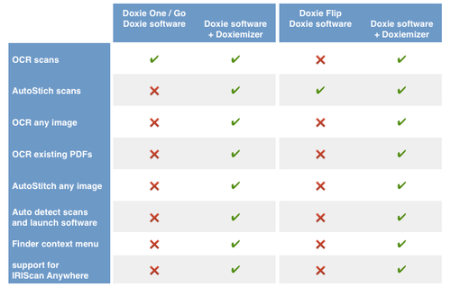
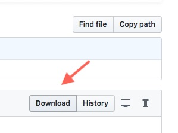
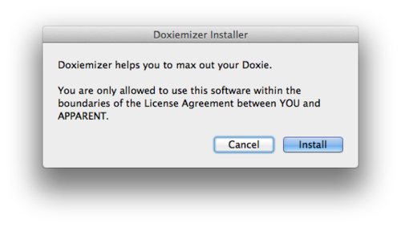
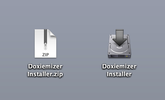
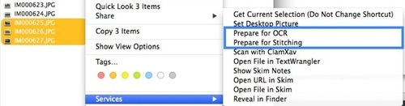
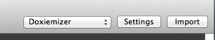

# Doxiemizer
The free & easy way to max out your Doxie scanner and to OCR/stich any image file or PDF from any source with your Doxie software.

## Table of content
  * [What is Doxiemizer?](#what-is-doxiemizer)
    + [~~10~~ 9 good reasons for using Doximiezer](#10-9-good-reasons-for-using-doximiezer)
    + [Free download](#free-download)
    + [Background](#background)
  * [Installation](#installation) 
    + [Requirements](#requirements)
    + [Download and installation](#download-and-installation)
  * [How To Use Doxiemizer](#how-to-use-doxiemizer)
      + [How to OCR an image or PDF](#how-to-ocr-an-image-or-pdf)
      + [How To OCR Doxie flip Images](#how-to-ocr-doxie-flip-images)
      + [IRIScan Anywhere 3 support](#iriscan-anywhere-3-support)
  * [F.A.Q.](#faq)
      - [Is the original Doxie software altered in any way?](#is-the-original-doxie-software-altered-in-any-way)
      - [Are the original image files altered in any way?](#are-the-original-image-files-altered-in-any-way)
      - [I have noticed a temporary Doxiemizer volume - what is this?](#i-have-noticed-a-temporary-doxiemizer-volume---what-is-this)
      - [What file formats are supported?](#what-file-formats-are-supported)
      - [What is the maximum file size?](#what-is-the-maximum-file-size)
      - [I cannot see the Prepare for OCR or Prepare for Stitching options in the context menu](#i-cannot-see-the-prepare-for-ocr-or-prepare-for-stitching-options-in-the-context-menu)
      - [I am missing some files from my selection on the import](#i-am-missing-some-files-from-my-selection-on-the-import)
      - [Is there any log file for Doxiemizer?](#is-there-any-log-file-for-doxiemizer)
      - [O.K. I’ve found the log but what do P4O and P4S mean?](#ok-i-ve-found-the-log-but-what-do-p4o-and-p4s-mean)
      - [How to uninstall Doxiemizer?](#how-to-uninstall-doxiemizer)
      - [I have accidentally deleted the Uninstaller](#i-have-accidentally-deleted-the-uninstaller)
      - [Any questions or suggestions?](#any-questions-or-suggestions)
  * [Disclaimer](#disclaimer)

## What is Doxiemizer?
Doxiemizer is a free add-on to your Doxie software to enable additional features and to speed up the work with your scanner.

### ~~10~~ 9 good reasons for using Doximiezer
1. OCR documents with your Doxie Flip
2. stitch scanned images with your Doxie Go, Doxie One or original Doxie
3. combine any image from any source with Doxie scans
4. OCR existing PDFs
5. stitch any image from any source
6. automatically detects a connected Doxie, USB stick or SD card with Doxie scans and opens the Doxie software
7. easy to use Finder context menu options
8. supports IRIScan Anywhere 3
9. last but not least - Doxiemizer is free

Any questions or suggestions? [Send me your feedback!](https://doxiemizer.uservoice.com/)

### Free download
[Doxiemizer Installer (2.3 MB)](Doxiemizer%20Installer.zip)

(If your download won't start, click the Download button)

### Background
The Doxie is great as long as the documents fit in the scanner. But how can you scan a document that is too large or too thick or has any glued or stapled objects on it? You simply can’t.

Doxiemizer allows you to combine documents from different sources in one Doxie document and save them as one OCR'ed PDF or stitched image. 

Take a photo of the document with your camera or mobile phone and use Doxiemizer to prepare the image files for import. If the document wont’t fit on one photo, just take two or more photos, choose Prepare for Stitching, stitch them together and choose Send to Prepare for OCR. 
## Installation
### Requirements
* Mac OS X 10.6.8 or above (AutoStitch needs 10.7 or above)
* Scanner - original Doxie, Doxie One, Doxie Go, Doxie Flip
	+ you can buy a Doxie here http://www.getdoxie.com/store/
* Doxie software - tested with version 2.4 and above
  http://help.getdoxie.com/doxiego/software

### Download and installation
Download and open the [Doxiemizer Installer (2.3 MB)](Doxiemizer%20Installer.zip)

(If your download won't start, click the Download button)

([scanned by VirusTotal](https://www.virustotal.com/gui/file/6442ff77f10a91289d55121f783ca3ca9c0de749d2bb39387ac7046f8b9f83bc/detection)  MD5 = a8297315a553e9e9b957d26d0cfac824)

Double click the Doxiemizer Installer - that’s all.

After the installation is finished you can start to use Doxiemizer right away.
## How To Use Doxiemizer
### How to OCR an image or PDF

* Select some images or PDFs in the Finder
* press the right mouse button to open the context menu
* choose **Prepare for OCR** or **Prepare for Stitching**

Copies of the original files are made and the Doxie software is opened.
You will find a new Doxiemizer volume ready for import.

You can now import, OCR or stitch and Save the files like any scan from your Doxie scanner.

### How To OCR Doxie flip images
To OCR images from your Doxie Flip or stitched images, use the new Prepare for OCR feature from the Send button.

After choosing this option you will hear a short sound and your images are ready to import.

You can now import, OCR and Save the files like any scan from your Doxie scanner.

### IRIScan Anywhere 3 support
If you own an IRIScan Anywhere and a Doxie, Doxiemizer helps you to use the Doxie software with documents scanned on your IRIS scanner; you don’t have to rescan the files any more.

When you plug in your IRIS scanner or IRIS SD card or IRIS USB stick Doxiemizer automatically prepares a copy of the IRIS files and starts the Doxie software, just like the files were scanned by your Doxie. 

## F.A.Q.
#### Is the original Doxie software altered in any way?
No. Doxiemizer does not change one bit of the Doxie software.
#### Are the original image files altered in any way?
No. Doxiemizer always works with copies of your files.
####  I have noticed a temporary Doxiemizer volume - what is this?
The Doxiemizer volume is a RAM disc that holds the copy of your files. As the volume is only needed for the import it is unmounted directly after the Doxie software has finished importing the files.
####  What file formats are supported?
The Prepare for OCR feature supports jpg, gif, png, tiff, pict, bmp and PDF files.
The Prepare for Stitching feature supports jpg, gif, png, tiff, pict and bmp files. If the original file is not a JPG the file will be converted to JPG automatically.
#### What is the maximum file size?
The maximum file size for OCR is 5100 x 9000 pixels and for stitching 2400 x 3600 pixels. Larger files will be scaled down and padded automatically, the original aspect ration is preserved.
####  I cannot see the Prepare for OCR or Prepare for Stitching options in the context menu
or
#### I am missing some files from my selection on the import
Please check if the file type of the selected files is supported by Doxiemizer. See above „[Supported file formats](#what-is-the-maximum-file-size)“

####  Is there any log file for Doxiemizer?
Open Applications/Utilities/Console.app and look for Doxiemizer.log

####  O.K. I’ve found the log but what do P4O and P4S mean?
These are indicators for the modules: 
P4O Prepare for OCR and P4S Prepare for Stitching

#### How to uninstall Doxiemizer?
To make uninstalling as easy as installing Doxiemizer comes with its own Uninstaller. Double click the Uninstaller and you are done.

#### I have accidentally deleted the Uninstaller
[Download Uninstaller (66 KB)](Doxiemizer%20Uninstaller.zip)

(If your download won't start, click the Download button)

#### Any questions or suggestions?
[Send me your feedback!](https://doxiemizer.uservoice.com/)

## Disclaimer
The software is provided „As Is“. You are only allowed to use the Doxie™ software within the boundaries of the license agreement between you and Apparent. You are not allowed to use this software, if you don’t own a Doxie Go/One/original for the OCR feature and/or a Doxie Flip for the stitching feature. If in doubt, don’t use it.

Doxie is a registered trademark of the [Apparent Corporation](https://www.itsapparent.com)

I.R.I.S. and I.R.I.S.’ product names are [I.R.I.S. trademarks](https://www.irislink.com/)
